# ⭐ Store Rating Platform

A Full Stack Store Rating Platform built using **React.js**, **Node.js (Express.js)**, **MySQL**, and **JWT Authentication**. The application enables users to rate stores, while providing dedicated dashboards for **System Administrators**, **Normal Users**, and **Store Owners** with role-based access control.

---

# 🚀 Tech Stack

## Frontend
- React.js
- React Router DOM
- Axios
- Material UI (MUI)
- Formik
- Yup
- CSS

## Backend
- Node.js
- Express.js
- JWT Authentication
- bcryptjs
- Express Validator

## Database
- MySQL

---

# ✨ Features

## 👨‍💼 System Administrator

- Secure Login
- Dashboard displaying:
  - Total Users
  - Total Stores
  - Total Ratings
- Add New Users
  - Admin
  - Normal User
  - Store Owner
- Add New Stores
- View All Users
- View All Stores
- View Detailed User Information
- View Store Average Ratings
- Search Users
  - Name
  - Email
  - Address
  - Role
- Search Stores
  - Name
  - Email
  - Address
- Sorting Support
  - Name
  - Email
  - Address
  - Role
- Logout

---

## 👤 Normal User

- User Registration
- Login
- Update Password
- Browse All Stores
- Search Stores
  - Name
  - Address
- View
  - Store Name
  - Address
  - Overall Rating
  - User Submitted Rating
- Submit Rating (1–5)
- Modify Existing Rating
- Logout

---

## 🏪 Store Owner

- Login
- Update Password
- Dashboard showing
  - All Stores Assigned
  - Average Rating for Each Store
  - Total Ratings for Each Store
- View Users Who Rated Their Stores
- Rating List includes
  - User Name
  - User Email
  - Store Name
  - Rating
  - Rating Date
- Logout

---

# ✅ Implemented Validations

## Backend Validation

- Name
  - Minimum 20 characters
  - Maximum 60 characters

- Address
  - Maximum 400 characters

- Email
  - Valid email format

- Password
  - 8–16 characters
  - At least one uppercase letter
  - At least one special character

- Rating
  - Allowed values: 1–5

---

# 🔒 Authentication

- JWT Authentication
- Password Hashing using bcrypt
- Protected Routes
- Role-Based Authorization
- Single Login API for:
  - Admin
  - User
  - Store Owner

---

# 📊 Functionalities

## Authentication

- Register
- Login
- Logout
- Change Password

## Store Management

- Create Store
- View Stores
- Search Stores
- Sort Stores
- Average Rating Calculation

## User Management

- Create Users
- View Users
- Search Users
- Sort Users
- View User Details

## Rating Management

- Submit Rating
- Update Rating
- View Overall Rating
- View User Rating
- View Users Who Rated Stores

---

# 🗄 Database Schema

## Users

| Column | Type |
|----------|----------|
| id | INT |
| name | VARCHAR(60) |
| email | VARCHAR(100) |
| password | VARCHAR(255) |
| address | VARCHAR(400) |
| role | ADMIN / USER / STORE_OWNER |

---

## Stores

| Column | Type |
|----------|----------|
| id | INT |
| name | VARCHAR(100) |
| email | VARCHAR(100) |
| address | VARCHAR(400) |
| owner_id | INT |

---

## Ratings

| Column | Type |
|----------|----------|
| id | INT |
| user_id | INT |
| store_id | INT |
| rating | INT (1–5) |

---

# 📂 Project Structure

```
Store Rating Platform
│
├── backend
│   ├── config
│   │     db.js
│   │
│   ├── controllers
│   │     adminController.js
│   │     authController.js
│   │     userController.js
│   │
│   ├── middleware
│   │     authMiddleware.js
│   │     roleMiddleware.js
│   │     validationMiddleware.js
│   │
│   ├── models
│   │     adminModel.js
│   │     authModel.js
│   │     userModel.js
│   │
│   ├── routes
│   │     adminRoutes.js
│   │     authRoutes.js
│   │     userRoutes.js
│   │
│   ├── .env
│   ├── package.json
│   └── server.js
│
├── frontend
│   ├── src
│   │
│   ├── components
│   │     Navbar.jsx
│   │     ProtectedRoute.jsx
│   │
│   ├── context
│   │     AuthContext.jsx
│   │
│   ├── pages
│   │     ├── admin
│   │     ├── owner
│   │     ├── user
│   │     ├── Login.jsx
│   │     ├── Register.jsx
│   │     └── ChangePassword.jsx
│   │
│   ├── services
│   │     api.js
│   │
│   ├── App.jsx
│   └── main.jsx
│
├── screenshots
│
└── README.md
```

---

# ⚙ Installation

## Clone Repository

```bash
git clone https://github.com/vaishnavisarad/store-rating-platform.git
```

```
cd store-rating-platform
```

---

# Backend Setup

```
cd backend
```

Install dependencies

```
npm install
```

Create `.env`

```env
PORT=5000

DB_HOST=localhost
DB_USER=root
DB_PASSWORD=root
DB_NAME=store_rating_platform
DB_PORT=3306

JWT_SECRET=store_rating_secret
```

Run Backend

```
npm start
```

or

```
nodemon server.js
```

---

# Frontend Setup

```
cd frontend
```

Install dependencies

```
npm install
```

Run Frontend

```
npm run dev
```

---

# 📷 Screenshots

## Login

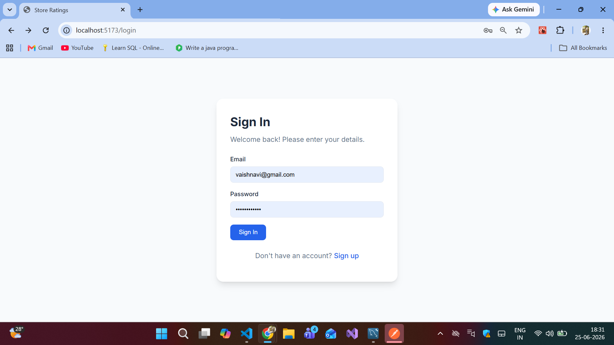

---

## Register

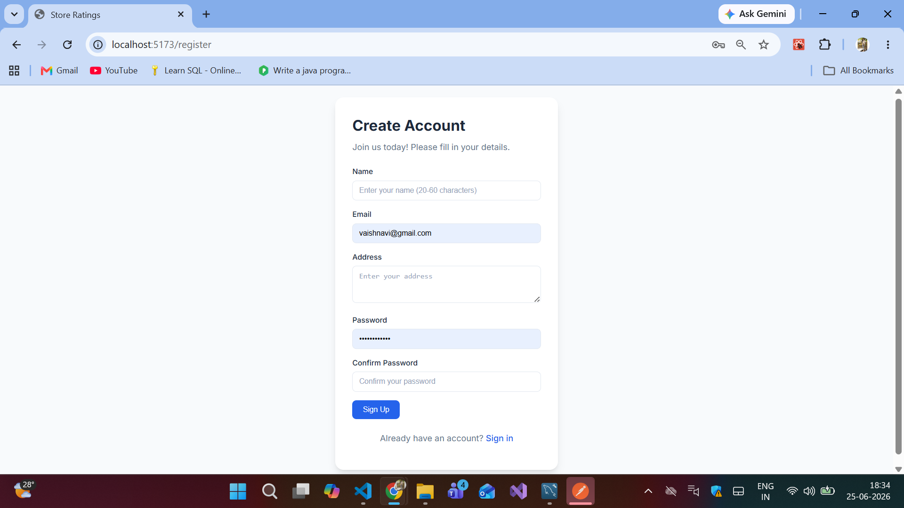

---

## Admin Dashboard

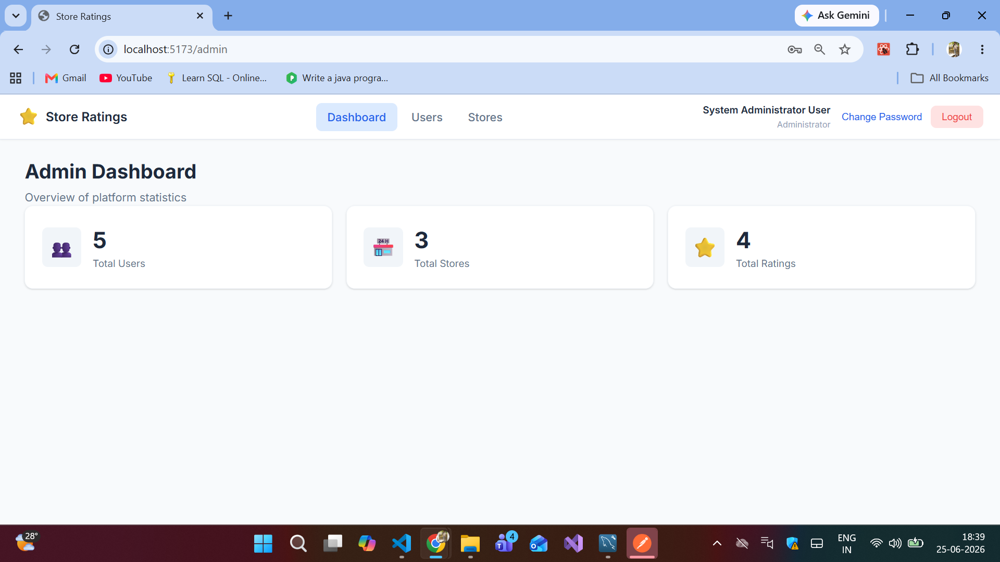

---

## Store Management

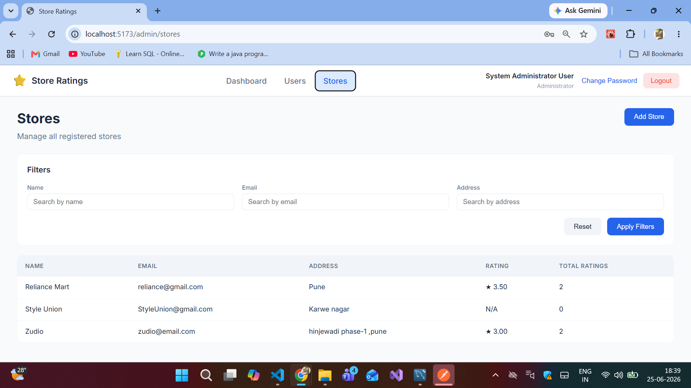

---

## User Management

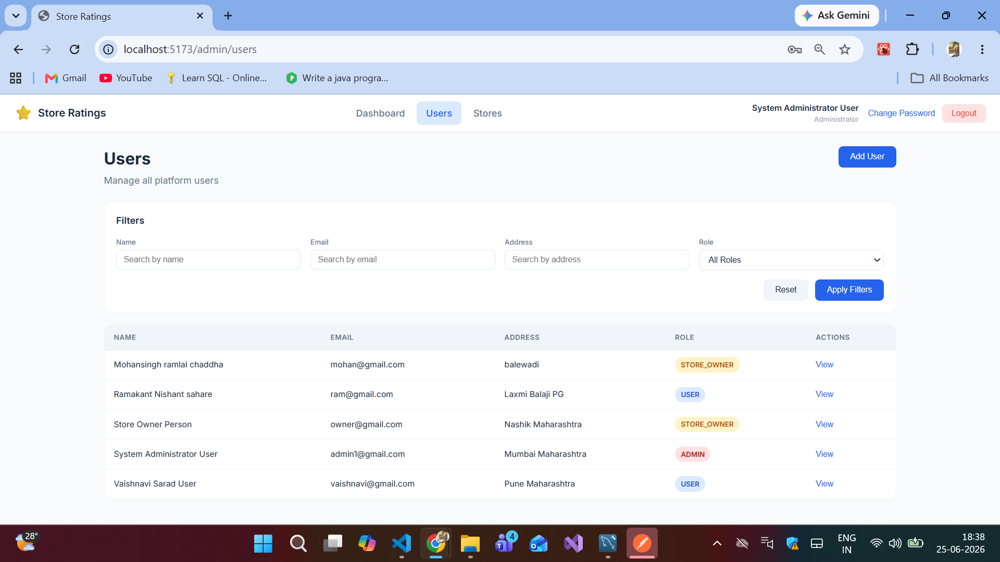

---

## Search Users

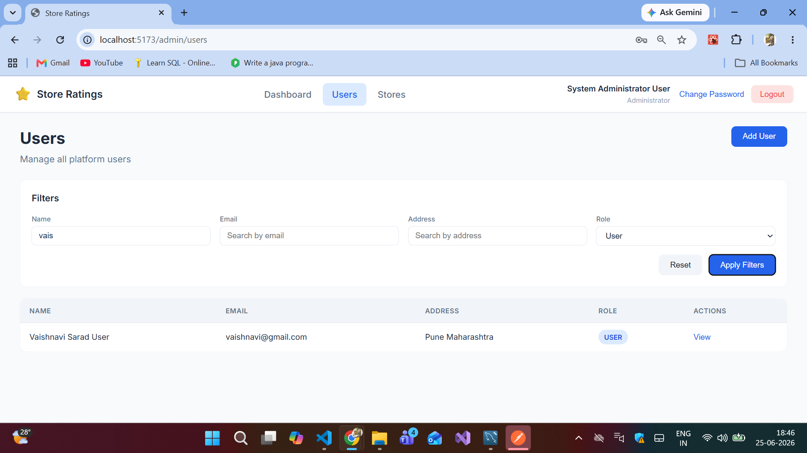

---

## User Dashboard

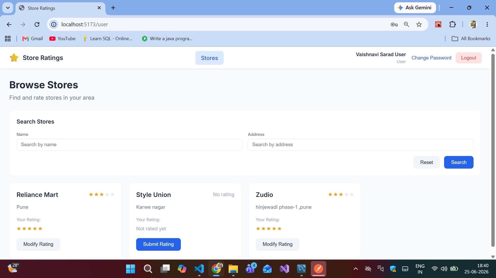

---

## Search Stores

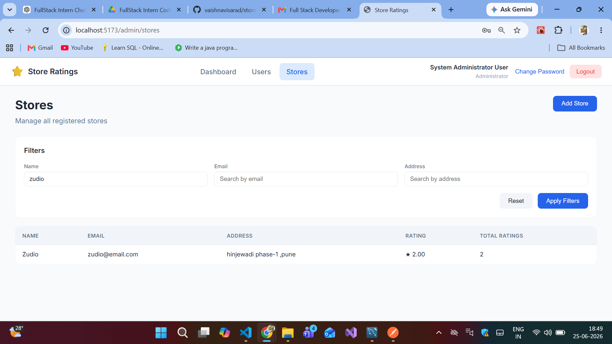

---

## Submit Rating

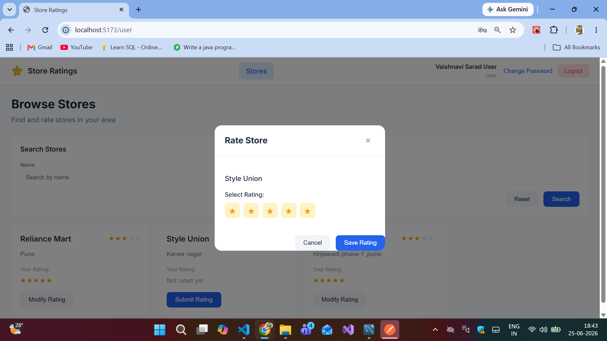

---

## Modify Rating

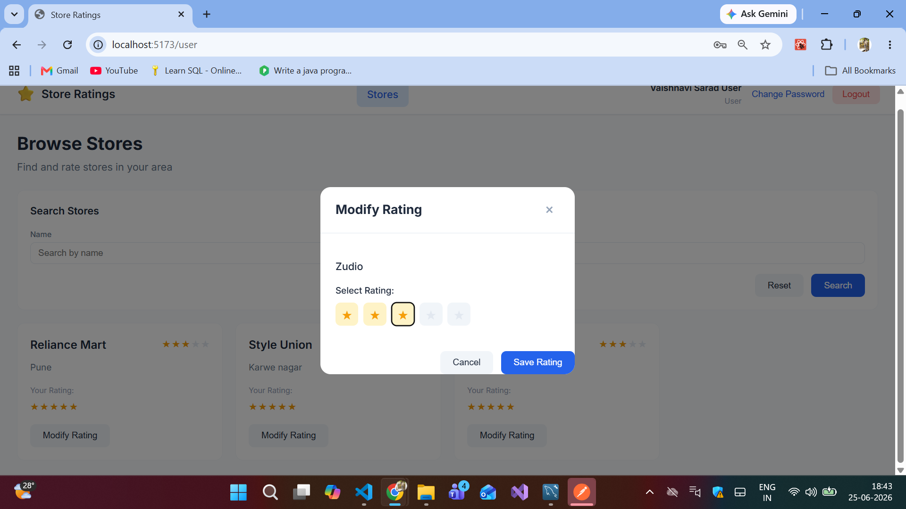

---

## Store Owner Dashboard

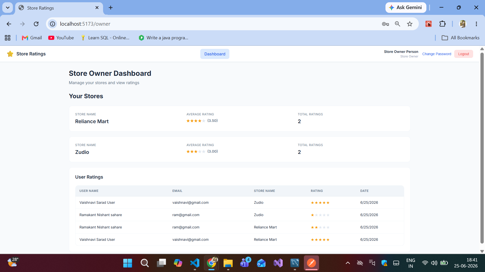

---

# 🔗 API Endpoints

## Authentication

| Method | Endpoint |
|----------|----------|
| POST | /api/auth/register |
| POST | /api/auth/login |
| PUT | /api/auth/change-password |
| POST | /api/auth/logout |

---

## Admin

| Method | Endpoint |
|----------|----------|
| GET | /api/admin/dashboard |
| GET | /api/admin/users |
| GET | /api/admin/stores |
| GET | /api/admin/users/:id |
| POST | /api/admin/users |
| POST | /api/admin/stores |

---

## User

| Method | Endpoint |
|----------|----------|
| GET | /api/user/stores |
| POST | /api/user/ratings |
| PUT | /api/user/ratings/:storeId |

---

## Store Owner

| Method | Endpoint |
|----------|----------|
| GET | /api/user/owner/dashboard |
| GET | /api/user/owner/ratings |

---

# 🎯 Challenge Requirements Covered

- ✅ Single Login System
- ✅ Role-Based Authentication
- ✅ Admin Dashboard
- ✅ User Dashboard
- ✅ Store Owner Dashboard
- ✅ Store Rating (1–5)
- ✅ Modify Ratings
- ✅ Average Rating Calculation
- ✅ Multiple Store Support for Store Owners
- ✅ Search Functionality
- ✅ Sorting Support
- ✅ Backend Validations
- ✅ JWT Authentication
- ✅ Password Encryption
- ✅ RESTful APIs
- ✅ MySQL Relational Database
- ✅ Responsive React Frontend

---

# 👩‍💻 Author

**Vaishnavi Sarad**

- GitHub: https://github.com/vaishnavisarad

---

⭐ If you found this project useful, feel free to star the repository.